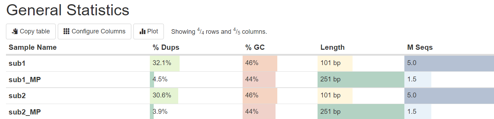
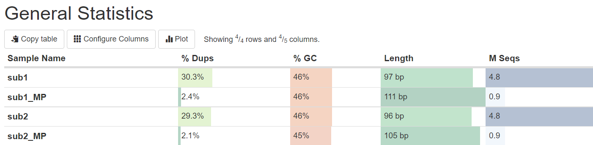
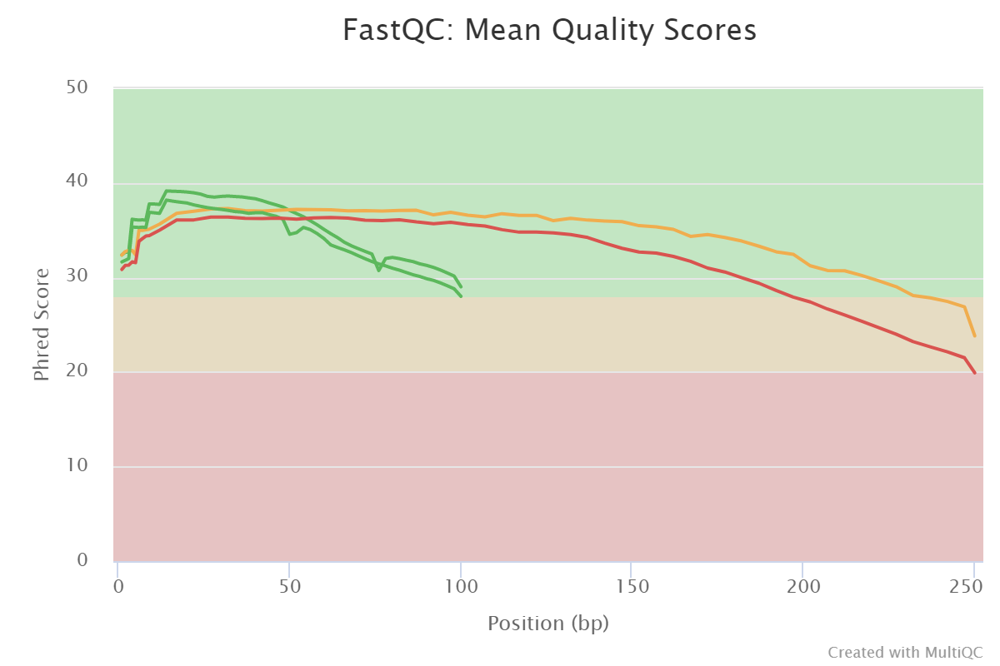
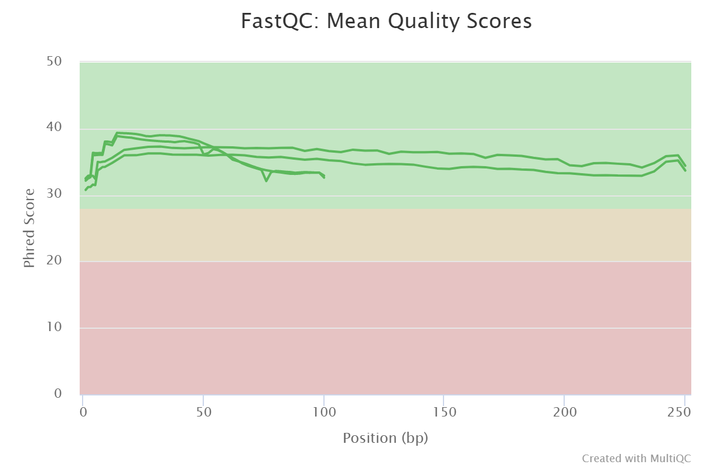
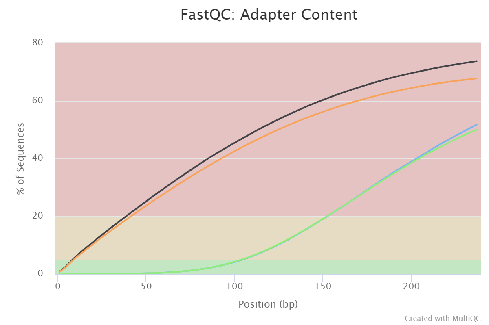
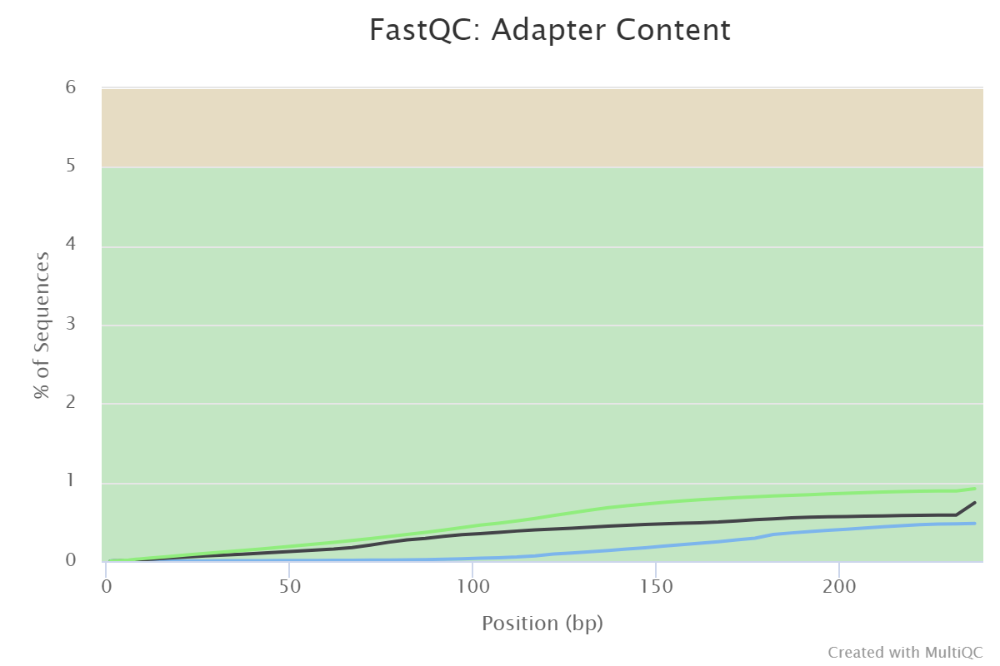

# Домашнее задание 1
## Часть 1
```
ln -s /usr/share/data-minor-bioinf/assembly/oil_R1.fastq 
ln -s /usr/share/data-minor-bioinf/assembly/oil_R2.fastq 
ln -s /usr/share/data-minor-bioinf/assembly/oilMP_S4_L001_R1_001.fastq 
ln -s /usr/share/data-minor-bioinf/assembly/oilMP_S4_L001_R2_001.fastq 

seqtk sample -s503 oil_R1.fastq 5000000 > sub1.fq
seqtk sample -s503 oil_R2.fastq 5000000 > sub2.fq
seqtk sample -s503 oilMP_S4_L001_R1_001.fastq 1500000 > sub1_MP.fq
seqtk sample -s503 oilMP_S4_L001_R2_001.fastq 1500000 > sub2_MP.fq

mkdir fastqc
ls sub* | xargs -tI{} fastqc -o fastqc {}

mkdir multiqc
multiqc -o multiqc fastqc

platanus_trim sub1.fq sub2.fq
platanus_internal_trim sub1_MP.fq sub2_MP.fq

rm sub1.fq
rm sub2.fq
rm sub1_MP.fq
rm sub2_MP.fq

mkdir trimmed_fastqc
ls sub* | xargs -tI{} fastqc -o trimmed_fastqc {}

mkdir trimmed_multiqc
multiqc -o trimmed_multiqc trimmed_fastqc

platanus assemble -f sub1.fq.trimmed sub2.fq.trimmed 2> assemble.log
grep '^>' out_contig.fa | wc -
```
Количество контигов 610

>platanus scaffold -c out_contig.fa -IP1 sub1.fq.trimmed sub2.fq.trimmed -OP2 sub1_MP.fq.int_trimmed sub2_MP.fq.int_trimmed 2> scaffold.log

Количество скаффолдов 75

>platanus gap_close -c out_scaffold.fa -IP1 sub1.fq.trimmed sub2.fq.trimmed -OP2 sub1_MP.fq.int_trimmed sub2_MP.fq.int_trimmed 2> gapclose.log
```

sed -n '1,/^>/p' out_scaffold.fa | head -n -1 >longest.fa
sed -n '1,/^>/p' out_gapClosed.fa | head -n -1 >longest_gap.fa
rm *seq
```
## Анализ multiqc 
### 1




### 2




### 3



## Вторая часть
Ссылка на colab: https://colab.research.google.com/drive/11-NBmadSZi6f12T7dgQ1-q9e_bSxt0xb?usp=sharing

####Для контигов:

>количество = 610
>общая длина = 3925436
>самый длинный = 179307
>N50 = 55039

#### Для скаффолдов:

>количество = 73
>общая длина = 3876314
>самый длинный = 3832485
>N50 = 3832485

###Подсчет количества гэпов для самого длинного скаффолда:
####До

>количество = 136
>общая длина = 6582

####После

>количество = 30
>общая длина = 1679
